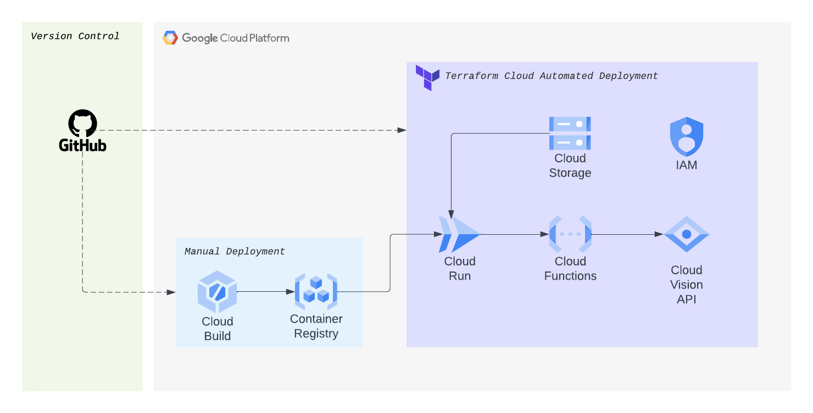

# Image Processing Service


A serverless solution to process images that is built from Google Cloud services and deployed with Terraform Cloud

## Deployment Steps [Demo Only]:

#### Github

-   Clone project to your github repo

#### Google Cloud

-   Create a new project on Google Cloud with [billing enabled](https://cloud.google.com/billing/docs/how-to/modify-project)

-   Build the base service container (manual deployment for demo purposes):

    ```
    gcloud builds submit
    ```

#### Terraform Cloud (Automated VCS Deployment)

-   Create account in Terraform Cloud

-   Set up Project and Workspace

-   Connect to Workspace with VCS (Github) and link to your Github repo

#### Source

-   Inspired By [Serverless Expedition](https://github.com/GoogleCloudPlatform/serverless-expeditions/tree/main/terraform-serverless)
